# Audit complet — Application Tofdan

## 1. Vue d'ensemble

### 1.1 Identité du projet

| Propriété | Valeur |
|---|---|
| **Nom** | Tofdan — Site d'Astrophotographie |
| **Domaine** | www.tofdan.be |
| **Propriétaires** | Tof & Syl |
| **Développeur** | Christophe |
| **Serveur** | LEO (Nginx, `/var/www/tofdan.be/`) |
| **GitHub** | `christophedanhier-hash/tofdan-site` (branche `main`) |
| **Date de création** | Juin 2026 |
| **État** | En construction |
| **Version** | 4 commits (Init → Iteration 2 → Bandeau → maj readme) |

### 1.2 Statistiques

| Fichier | Lignes | Type |
|---|---|---|
| `css/style.css` | 1496 | Styles |
| `js/meteo.js` | 627 | Script météo |
| `js/main.js` | 99 | Script principal |
| `materiel.html` | 191 | Page |
| `meteo-astro.html` | 191 | Page |
| `biblio.html` | 182 | Page |
| `album.html` | 158 | Page |
| `news.html` | 125 | Page |
| `chat.html` | 113 | Page |
| `index.html` | 112 | Page |
| `app-astro.html` | 111 | Page |
| `astro.html` | 100 | Page |
| **Total** | **3505** | |

---

## 2. Architecture technique

### 2.1 Stack

Le site est 100% statique : zéro build, zéro framework, zéro dépendance runtime hors Google Fonts.

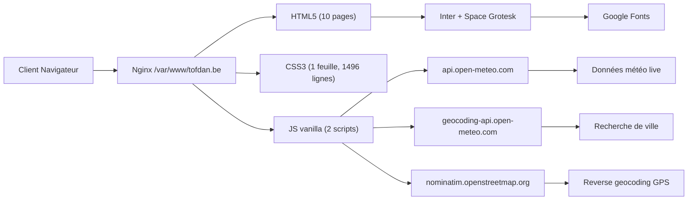

### 2.2 Modèle de composants — Duplication

Le site n'utilise ni framework ni templating. Chaque page duplique manuellement les composants partagés.

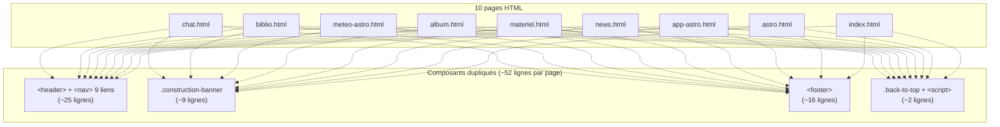

**Code dupliqué total** : ~52 lignes × 10 pages = ~520 lignes, soit **25% du code HTML**.

### 2.3 Arborescence

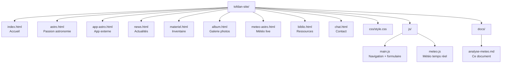

### 2.4 Design System

Thème spatial sombre défini par 18 variables CSS (`:root`).

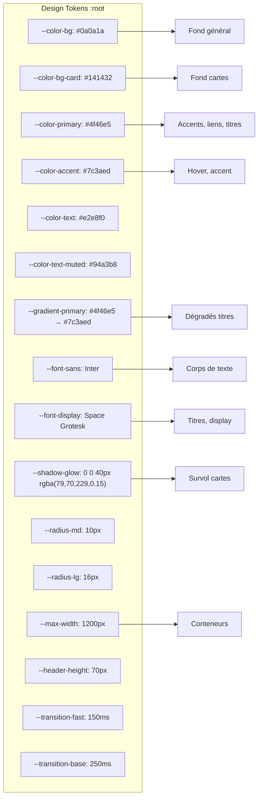

---

## 3. Audit page par page

### 3.1 index.html — Accueil (112 lignes)

**Rôle** : Page d'entrée, Hero banner, cartes Vedette.

**Contenu** :
- Hero fullscreen avec fond étoilé CSS (26 étoiles `radial-gradient`)
- Animation `float` sur l'icône télescope
- 2 boutons CTA : Album (primary) + Astro (outline)
- Section Welcome + 2 cartes Featured (Lune, Soleil) avec emojis

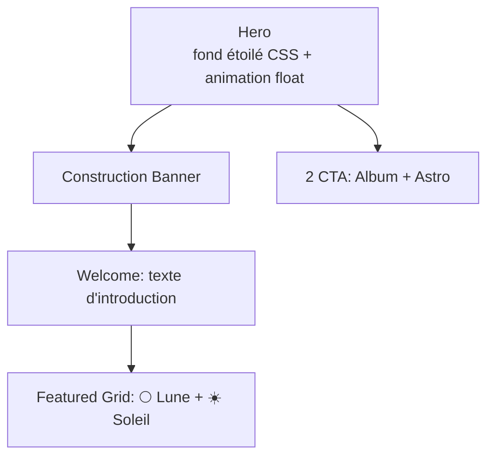

| Point | État | Détail |
|---|---|---|
| Hero | ✅ | Design attractif, responsive |
| CTA | ✅ | Deux boutons distincts, bon contraste |
| SEO | ✅ | Meta description + title personnalisés |
| Placeholders | ⚠️ | Images remplacées par emojis |
| Construction banner | ✅ | Placé après le hero (pas en haut) |
| Featured cards | ❌ | Cartes non cliquables |

### 3.2 astro.html — Passion (100 lignes)

**Rôle** : Présentation de la passion astronomie.

**Contenu** : 5 paragraphes (`prose`), signature, coordonnées GPS (50°32' N, 4°36' E).

| Point | État | Détail |
|---|---|---|
| Contenu | ✅ | Texte bien rédigé, narratif personnel |
| Coordonnées | ✅ | Info-box dédiée |
| SEO | ✅ | Meta description pertinente |
| Liens internes | ❌ | Aucun lien vers album, météo ou contact |
| Call-to-action | ❌ | Page sans CTA — risque de rebond |

### 3.3 app-astro.html — Application externe (111 lignes)

**Rôle** : Vitrine pour l'application Astro sur GitHub Pages.

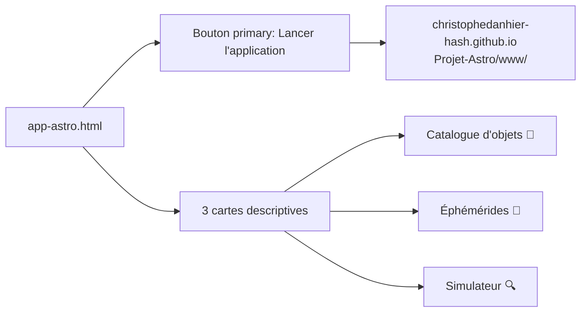

| Point | État | Détail |
|---|---|---|
| CTA principal | ✅ | Bouton primary bien visible |
| Description | ✅ | 3 cartes informatives |
| Lien externe | ✅ | `rel="noopener noreferrer"` présent |
| Contenu | ⚠️ | Très léger — pourrait fusionner avec astro.html |

### 3.4 news.html — Actualités (125 lignes)

**Rôle** : Blog avec 4 articles d'exemple.

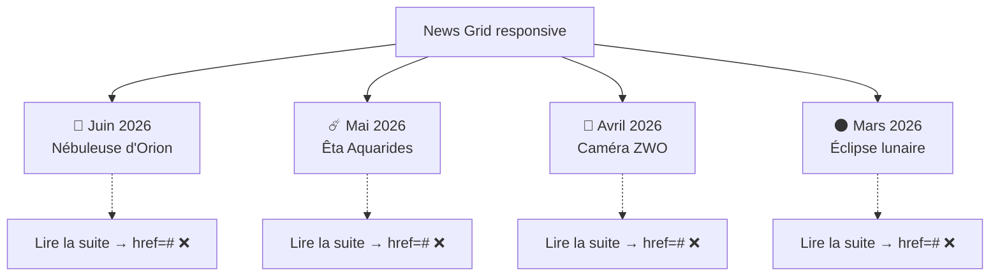

| Point | État | Détail |
|---|---|---|
| Structure | ✅ | `<article>` sémantique, dates formatées |
| Contenu | ⚠️ | 4 articles, liens morts (`href="#"`) |
| Grille | ✅ | 1 colonne mobile, 2 colonnes desktop |
| Images | ❌ | Emojis placeholder |

### 3.5 materiel.html — Matériel (191 lignes)

**Rôle** : Inventaire complet de l'équipement.

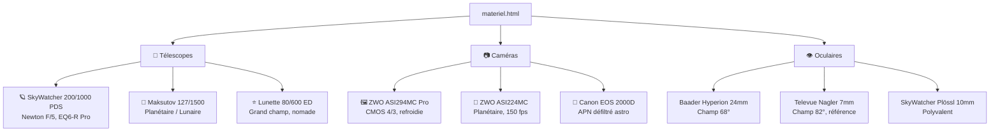

| Point | État | Détail |
|---|---|---|
| Organisation | ✅ | 3 catégories, 3×3 cartes |
| Données | ✅ | Spécifications techniques précises |
| Cohérence | ⚠️ | Oculaires sans icônes |
| Grille | ✅ | 1→2→3 colonnes responsive |

### 3.6 album.html — Galerie (158 lignes)

**Rôle** : Galerie photo avec 15 emplacements.

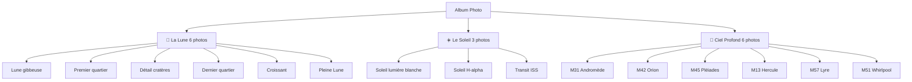

| Point | État | Détail |
|---|---|---|
| Structure | ✅ | Grille responsive 1→2→3 colonnes |
| Overlay | ✅ | Animation CSS au survol |
| Placeholders | ❌ | Tous des emojis, pas de vraies photos |
| Ratio | ⚠️ | `aspect-ratio: 1` forcé (carré) |
| Équilibre | ⚠️ | 6 Lune, 3 Soleil, 6 ciel profond |

### 3.7 meteo-astro.html — Météo (191 lignes)

**Rôle** : Indicateurs météo en temps réel avec choix de localisation.

**Contenu** :
- Barre de recherche de ville avec autocomplétion (Open-Meteo Geocoding API)
- Bouton géolocalisation GPS (Navigator API + Nominatim reverse geocoding)
- Historique des 5 dernières localisations (localStorage, chips cliquables)
- 8 cartes avec données live (API Open-Meteo)
- Spinner de chargement + barre d'erreur + bouton refresh + timestamp
- Phase lunaire calculée côté client
- Liens Meteoblue + Clear Outside

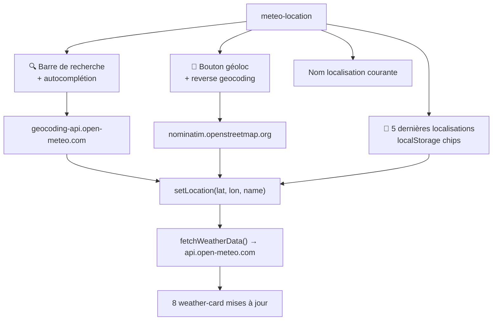

| Point | État | Détail |
|---|---|---|
| Données live | ✅ | Open-Meteo, 11 variables, pas de clé |
| Recherche ville | ✅ | Geocoding gratuit, débouce 300ms, état chargement + erreur visibles |
| Géoloc GPS | ✅ | Navigator API + Nominatim, messages d'erreur dédiés |
| Localisations récentes | ✅ | localStorage, max 5, sans doublons, chips cliquables |
| UX | ✅ | Loading, erreurs, refresh, timestamp, mousedown preventDefault |
| Algorithme | ✅ | Seeing composite + phase lunaire |
| Liens externes | ✅ | Meteoblue + Clear Outside |
| Débogage recherche | ℹ️ | Bug signalé (pas d'autocomplétion) : cause = cache navigateur / déploiement pas à jour. Code correct. |

### 3.8 biblio.html — Ressources (182 lignes)

**Rôle** : Recommandations : livres, logiciels, liens.

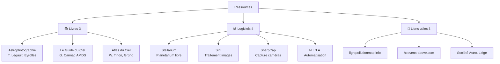

| Point | État | Détail |
|---|---|---|
| Qualité des liens | ✅ | Références pertinentes |
| Liens externes | ✅ | `rel="noopener noreferrer"` |
| Nombre | ⚠️ | Seulement 10 ressources |

### 3.9 chat.html — Contact (113 lignes)

**Rôle** : Formulaire de contact (⚠️ sans backend).

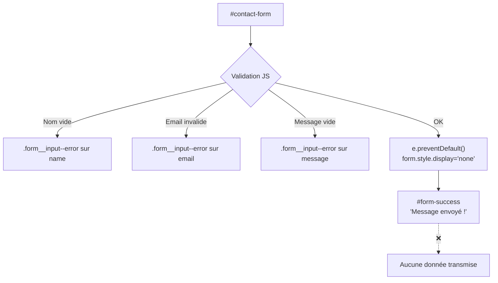

| Point | État | Détail |
|---|---|---|
| Validation | ✅ | HTML5 (`required`) + JS (regex email) |
| UX erreur | ✅ | `.form__input--error` bien visible |
| UX succès | ✅ | Animation de confirmation |
| Backend | ❌ | `e.preventDefault()` empêche toute soumission réelle |
| Sécurité | ⚠️ | Pas de rate limiting, honeypot, ni CAPTCHA |

---

## 4. Audit CSS (style.css — 1496 lignes)

### 4.1 Structure

```mermaid
flowchart TB
    subgraph CSS["style.css — 1496 lignes"]
        direction TB
        R["Reset + Design Tokens (43 lignes)"]
        H["Header & Navigation (111 lignes)"]
        MC["Main Content — container, section (65 lignes)"]
        HE["Hero — fond étoilé, float (102 lignes)"]
        BTN["Buttons — 3 variantes (54 lignes)"]
        BN["Construction Banner (30 lignes)"]
        WEL["Welcome (15 lignes)"]
        FEAT["Featured Cards (51 lignes)"]
        CD["Cards — matériel, biblio (68 lignes)"]
        GAL["Gallery — overlay, grid (62 lignes)"]
        NWS["News Cards (66 lignes)"]
        FORM["Contact Form — validation, succès (90 lignes)"]
        LOC["Meteo Location — search, geoloc, chips (155 lignes)"]
        WTH["Weather Cards + meteo-status (86 lignes)"]
        INFO["Info Box (12 lignes)"]
        SIG["Signature (5 lignes)"]
        PRS["Prose — contenu texte (27 lignes)"]
        BIB["Bibliography — items (49 lignes)"]
        FT["Footer + social (69 lignes)"]
        BTT["Back to Top (34 lignes)"]
        RSP["Responsive (137 lignes)"]
        UTL["Utilities (29 lignes)"]
    end

    R --> H --> MC --> HE --> BTN --> BN --> WEL
    WEL --> FEAT --> CD --> GAL --> NWS --> FORM
    FORM --> LOC --> WTH --> INFO --> SIG --> PRS
    PRS --> BIB --> FT --> BTT --> RSP --> UTL
```

### 4.2 Qualité

| Critère | Score | Détail |
|---|---|---|
| Design tokens | ✅ | 18 variables CSS bien nommées |
| BEM naming | ✅ | Cohérent : `.block__element--modifier` |
| Responsive | ✅ | 3 breakpoints, mobile-first |
| Animations | ✅ | `float`, `spin`, `pulse`, transitions fluides |
| Inline styles | ⚠️ | `style="padding-top:0"` et `margin-top:48px` dans 6 pages |
| Duplication | ⚠️ | `.card`, `.weather-card`, `.news-card`, `.featured-card` partagent ~60% de styles communs |
| Dark mode | ❌ | Pas de `prefers-color-scheme` |

---

## 5. Audit JavaScript

### 5.1 main.js (99 lignes)

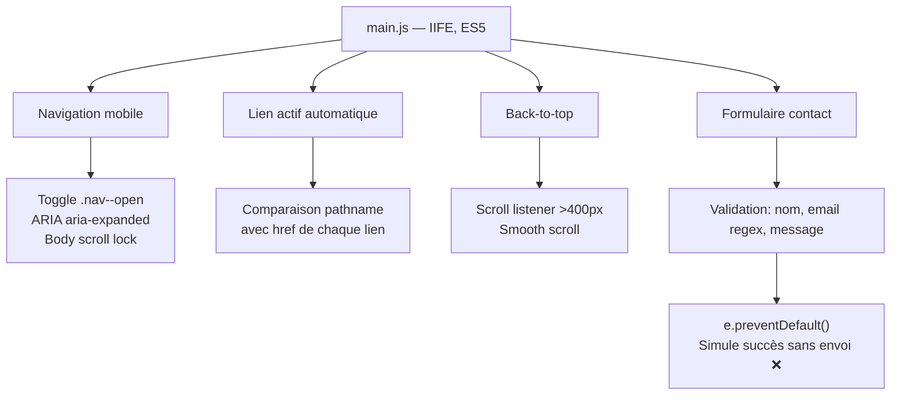

| Fonctionnalité | Implémentation | Qualité |
|---|---|---|
| Burger menu | Toggle `.nav--open`, ARIA `aria-expanded`, scroll lock | ✅ |
| Lien actif | Comparaison `pathname` avec `href` | ✅ |
| Back-to-top | Scroll listener 400px, `{ passive: true }`, smooth scroll | ✅ |
| Formulaire | Validation nom/email/message, succès simulé | ❌ |
| Structure | IIFE `(function(){'use strict';})()` | ✅ |
| Compatibilité | ES5 (pas de `const`/`let`, pas de `=>`) | ✅ |

**Problèmes** :
- Le formulaire bloque toute soumission réelle (`e.preventDefault()` + masquage)
- La détection du lien actif a deux passes redondantes (lignes 19-32 et 88-98)

---

## 6. Points de vigilance

### 6.1 Structurels

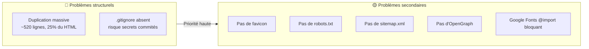

### 6.2 Fonctionnels

| Problème | Impact | Priorité |
|---|---|---|
| **Formulaire contact factice** | L'utilisateur croit avoir envoyé un message, rien n'est transmis | 🔴 Haute |
| **Galerie sans photos** | 15 emplacements vides (emojis). Page inutile | 🔴 Haute |
| **Featured cards sans liens** | Cartes Lune/Soleil sur l'accueil non cliquables | 🟡 Moyenne |
| **Liens « Lire la suite » morts** | `href="#"` sur 4 articles | 🟡 Moyenne |
| **Liens footer morts** | Mentions légales et CGU → `href="#"` | 🟡 Moyenne |
| **Pas de page 404** | Erreur navigateur par défaut | 🟢 Basse |

### 6.3 CSS

| Problème | Impact | Priorité |
|---|---|---|
| **Inline styles dans HTML** | `style="padding-top:0"` et `margin-top:48px` dans 6 pages | 🟡 Moyenne |
| **Cartes non factorisées** | `.card`, `.weather-card`, `.news-card`, `.featured-card` dupliqués | 🟢 Basse |
| **`aspect-ratio:1` forcé** | Galerie en carré même pour photos rectangulaires | 🟢 Basse |

### 6.4 JS

| Problème | Impact | Priorité |
|---|---|---|
| **Formulaire sans backend** | `e.preventDefault()` empêche tout envoi | 🔴 Haute |
| **Double détection lien actif** | `main.js:88-98` redondant avec `main.js:19-32` | 🟢 Basse |

---

## 7. Module Météo — Analyse détaillée

### 7.1 Architecture

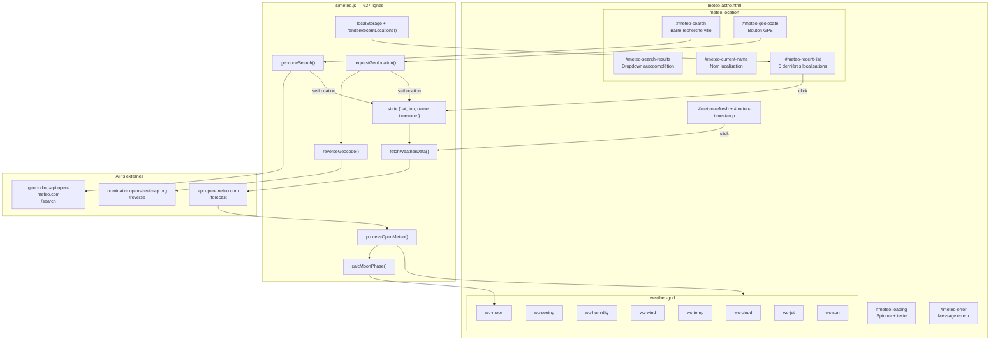

### 7.2 Sources de données

#### 7.2.1 Météo — Open-Meteo Forecast

| Paramètre | Valeur |
|---|---|
| Endpoint | `https://api.open-meteo.com/v1/forecast` |
| Coordonnées | Dynamiques (défaut : 50.5333°N, 4.6°E) |
| Fuseau horaire | Auto-détecté via réponse API |
| Forecast | 24 heures |
| Licence | Gratuit, 10 000 req/jour (non commercial) |
| Authentification | Aucune |

#### 7.2.2 Géocodage — Open-Meteo Geocoding

| Paramètre | Valeur |
|---|---|
| Endpoint | `https://geocoding-api.open-meteo.com/v1/search` |
| Paramètres | `name`, `count=5`, `language=fr`, `format=json` |
| Licence | Gratuit, même quota que l'API météo |
| Authentification | Aucune |

#### 7.2.3 Reverse Geocoding — Nominatim (OpenStreetMap)

| Paramètre | Valeur |
|---|---|
| Endpoint | `https://nominatim.openstreetmap.org/reverse` |
| Paramètres | `lat`, `lon`, `format=json`, `accept-language=fr`, `zoom=10` |
| Licence | Gratuit, usage limité à 1 req/s (politesse) |
| Authentification | User-Agent requis |
| Fallback | Si échec : affichage brut `lat, lon` |

#### URL météo construite

```
https://api.open-meteo.com/v1/forecast
  ?latitude={state.lat}
  &longitude={state.lon}
  &hourly=cloud_cover,cloud_cover_low,cloud_cover_mid,cloud_cover_high,
           relative_humidity_2m,dew_point_2m,temperature_2m,
           wind_speed_10m,wind_gusts_10m,wind_speed_250hPa
  &daily=sunrise,sunset
  &timezone={state.timezone}
  &forecast_hours=24
```

Les coordonnées et le fuseau horaire sont dynamiques — mis à jour à chaque changement de localisation.

#### Mapping variables → indicateurs

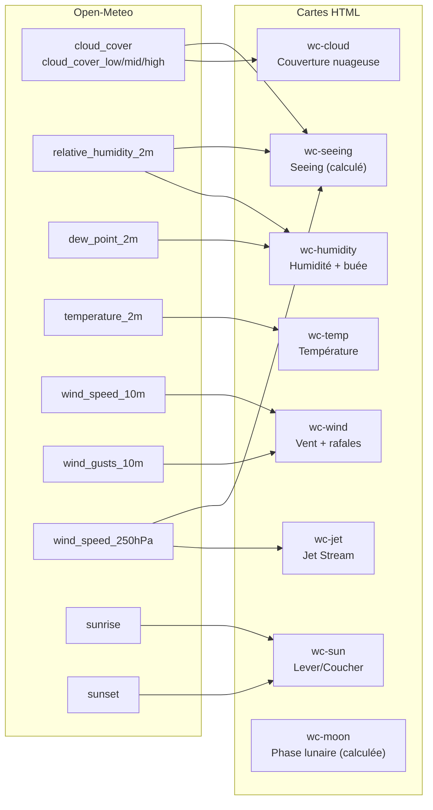

### 7.3 Algorithme du Seeing

**Formule** :
```
seeing = (jetSpeed / 40) + (cloudCover / 100) + (humidity / 100)
```

- Jet Stream (coeff 1/40) : facteur dominant
- Nuages (coeff 1/100) : contribution modérée
- Humidité (coeff 1/100) : contribution modérée

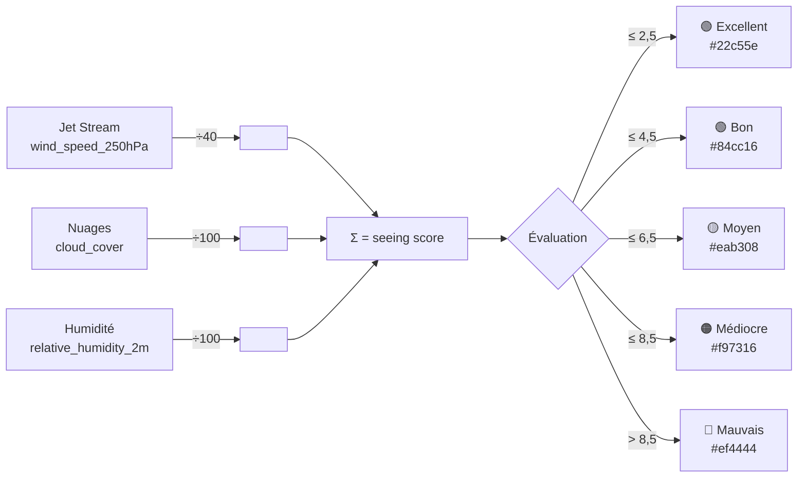

**Exemple** : Jet 85 km/h, nuages 30%, humidité 60% → `(85/40)+(30/100)+(60/100)` = **3,0 (Bon)**.

### 7.4 Algorithme de la phase lunaire

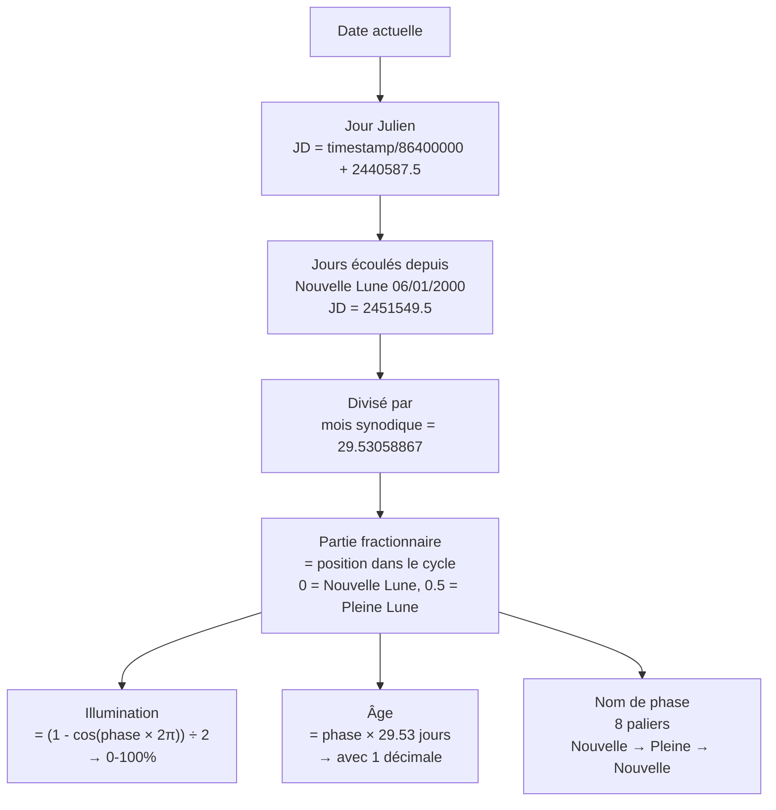

**Précision** : ± quelques heures, suffisant pour l'usage amateur.

### 7.5 Gestion des localisations

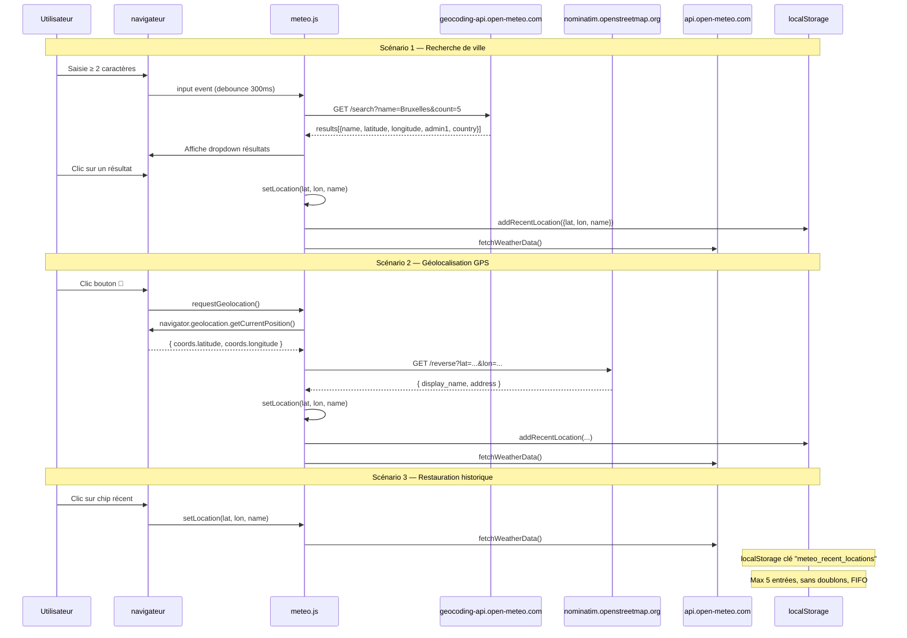

**Stockage localStorage** :
```json
[
  {"name": "Bruxelles, Bruxelles-Capitale, Belgique", "lat": 50.8505, "lon": 4.3488},
  {"name": "Villers-la-Ville, Belgique", "lat": 50.5333, "lon": 4.6}
]
```

### 7.6 Flux de données météo

```mermaid
sequenceDiagram
    participant DOM as navigateur
    participant JS as meteo.js
    participant API as api.open-meteo.com

    DOM->>JS: DOMContentLoaded
    JS->>JS: init()
    JS->>JS: Cache références DOM (15+ éléments : cartes, contrôles, location)
    JS->>JS: Bind events (search, geolocate, refresh, click-outside)
    JS->>JS: renderRecentLocations() depuis localStorage
    JS->>JS: fetchWeatherData()

    JS->>DOM: showLoading()
    Note over DOM: Affiche spinner<br/>Pulse animation sur cartes<br/>Désactive bouton refresh

    JS->>API: GET /v1/forecast?latitude=...&hourly=...
    API-->>JS: JSON (24h × 11 variables + daily)

    alt Succès
        JS->>JS: processOpenMeteo(data)
        JS->>JS: getCurrentHourIndex()
        JS->>JS: Extrait valeurs de l'heure courante
        JS->>JS: Calcule seeing = (jet/40)+(cloud/100)+(humidity/100)
        JS->>JS: calcMoonPhase(new Date())
        JS->>DOM: updateCard() × 8
        JS->>DOM: hideLoading()
        Note over DOM: Masque spinner<br/>Réactive bouton<br/>Affiche timestamp
    else Échec réseau / API
        JS->>JS: calcMoonPhase(new Date())
        JS->>DOM: updateCard('wc-moon', ...)
        JS->>DOM: showError("Impossible de récupérer...")
        Note over DOM: Affiche message rouge
    end
```

### 7.7 Gestion des erreurs améliorée

| Scénario | Comportement |
|---|---|
| Réseau météo injoignable | Message « Impossible de récupérer les données météo. Vérifiez votre connexion internet. » |
| Erreur HTTP météo | Affichage du code d'erreur |
| API météo retourne `error: true` | Affichage du champ `reason` |
| Variable absente de la réponse | La carte conserve le placeholder `—` |
| `wind_speed_250hPa` absent | Fallback sur `wind_speed_200hPa`, sinon pas de Jet Stream |
| Géocodage sans résultat | Dropdown masqué |
| Géocodage en cours | « Recherche en cours... » affiché dans le dropdown |
| Géocodage échec réseau | « Erreur de recherche. Réessayez. » affiché dans le dropdown |
| Géocodage réponse vide | « Erreur de recherche. Réessayez. » |
| Géolocalisation refusée (code 1) | « Géolocalisation refusée. Veuillez autoriser l'accès à votre position. » |
| Géolocalisation indisponible (code 2) | « Position indisponible. Vérifiez votre connexion. » |
| Géolocalisation timeout (code 3) | « Délai de géolocalisation dépassé. » |
| Reverse geocoding échec | Affiche les coordonnées brutes `lat, lon` |
| localStorage plein/corrompu | Capture silencieuse, la liste récente est vide |
| Échec API mais lune OK | La phase lunaire est toujours calculée et affichée |
| Cache navigateur / déploiement | Vider le cache (Ctrl+F5) ou redéployer si l'interface ne réagit pas (code JS correct, pas de bug) |

### 7.8 Structure du code (meteo.js — 627 lignes)

```mermaid
flowchart TD
    IIFE["meteo.js<br/>IIFE (function(){...})()"]

    IIFE --> CONFIG["Configuration<br/>state { lat, lon, name, timezone }<br/>LS_KEY, MAX_RECENT"]
    IIFE --> DOMREF["Références DOM<br/>15 éléments : cartes, input, boutons"]
    IIFE --> CALC["Calculs"]
    IIFE --> DISPLAY["Affichage"]
    IIFE --> UI["État UI"]
    IIFE --> LOCATION["Localisation"]
    IIFE --> PROC["Traitement météo"]
    IIFE --> ENTRY["init()"]

    CALC --> C1["calcMoonPhase(date)<br/>→ name, illumination, age"]
    CALC --> C2["seeingLabel(score)<br/>→ Excellent...Mauvais"]
    CALC --> C3["seeingColor(score)<br/>→ couleur CSS"]

    DISPLAY --> D1["moonEmoji/cloudEmoji/<br/>windEmoji/humidityEmoji/<br/>tempEmoji/jetEmoji"]
    DISPLAY --> D2["updateCard(id, val, detail)<br/>→ mise à jour DOM"]

    UI --> U1["showLoading()"]
    UI --> U2["hideLoading()"]
    UI --> U3["showError(msg)"]

    LOCATION --> L1["geocodeSearch(query)<br/>→ Open-Meteo Geocoding"]
    LOCATION --> L2["reverseGeocode(lat, lon)<br/>→ Nominatim OSM"]
    LOCATION --> L3["requestGeolocation()<br/>→ navigator.geolocation"]
    LOCATION --> L4["setLocation(lat, lon, name)<br/>→ state + recent + fetch"]
    LOCATION --> L5["getRecentLocations()<br/>→ localStorage JSON parse"]
    LOCATION --> L6["addRecentLocation(loc)<br/>→ max 5, sans doublons"]
    LOCATION --> L7["renderRecentLocations()<br/>→ chips cliquables"]
    LOCATION --> L8["showSearchLoading()<br/>→ feedback visuel attente"]
    LOCATION --> L9["showSearchError(msg)<br/>→ feedback visuel erreur"]

    PROC --> P1["getCurrentHourIndex()<br/>→ index heure actuelle"]
    PROC --> P2["processOpenMeteo(data)<br/>→ parse + updateCard × 8"]
    PROC --> P3["fetchWeatherData()<br/>→ fetch + then/catch"]

    ENTRY --> DOMREF
    ENTRY --> L7
    ENTRY --> P3
```

### 7.9 Performances

| Métrique | Valeur |
|---|---|
| Appels HTTP chargement initial | 1 (Open-Meteo forecast) |
| Appels HTTP recherche ville | 1 (Open-Meteo geocoding, debounce 300ms) |
| Appels HTTP géoloc GPS | 1 (Nominatim reverse) |
| Taille réponse forecast | ~3–8 Ko |
| Taille réponse geocoding | ~1–3 Ko |
| Poids JS météo | ~15 Ko (non minifié, 627 lignes) |
| Calcul lune | < 0,1 ms (synchrone) |
| localStorage R/W | < 1 ms |
| Reflows DOM | Aucun forcé (modifications groupées) |

---

## 8. Extensibilité

### 8.1 Court terme

| Amélioration | Effort | Impact |
|---|---|---|
| Résoudre le formulaire de contact (backend PHP ou service tiers) | 2h | Critique |
| Ajouter un `.gitignore` | 5 min | Sécurité |
| Ajouter un favicon | 15 min | Image de marque |
| Remplir la galerie avec de vraies photos | Variable | Contenu |
| Rendre les featured cards cliquables | 5 min | UX |

### 8.2 Moyen terme

| Amélioration | Effort | Impact |
|---|---|---|
| Templating (SSI Nginx ou script build) pour éliminer la duplication | 3h | Maintenance |
| Ajouter WeatherAPI pour éphémérides lunaires plus précises | 1h | Précision |
| Page 404 personnalisée | 30 min | UX |
| OpenGraph / Twitter Cards | 30 min | SEO Social |
| `robots.txt` + sitemap.xml | 30 min | SEO |

### 8.3 Long terme

| Amélioration | Effort | Impact |
|---|---|---|
| Prévisions météo multi-jours (graphique/tableau) | 4h | Fonctionnalité |
| Base statique Bortle Scale pour pollution lumineuse | 3h | Fonctionnalité |
| Migration vers un générateur statique (11ty/Astro) | 8h | Architecture |

---

## 9. Plan d'action prioritaire

```mermaid
flowchart TD
    START[Plan d'action] --> RED[🔴 Bloquant]
    START --> YELLOW[🟡 Important]
    START --> GREEN[🟢 Confort]

    RED --> R1["1. Formulaire contact<br/>→ backend réel"]
    RED --> R2["2. .gitignore<br/>→ sécuriser le repo"]

    YELLOW --> Y1["3. Galerie photos<br/>→ vraies images"]
    YELLOW --> Y2["4. Liens morts<br/>→ remplacer href='#'"]
    YELLOW --> Y3["5. Favicon"]
    YELLOW --> Y4["6. Templating<br/>→ SSI Nginx"]

    GREEN --> G1["7. Featured cards cliquables"]
    GREEN --> G2["8. SEO: OG, sitemap, robots.txt"]
    GREEN --> G3["9. Page 404"]
    GREEN --> G4["10. Inline styles → classes"]
```

---

## 10. Récapitulatif des fichiers

| Fichier | Lignes | État | Notes |
|---|---|---|---|
| `index.html` | 112 | ✅ | Accueil complet |
| `astro.html` | 100 | ✅ | Manque CTA |
| `app-astro.html` | 111 | ✅ | Page vitrine |
| `news.html` | 125 | ⚠️ | Liens morts |
| `materiel.html` | 191 | ✅ | Complet |
| `album.html` | 158 | ❌ | Placeholders |
| `meteo-astro.html` | 191 | ✅ | Recherche ville + géoloc + météo live + lune |
| `biblio.html` | 182 | ✅ | Complet |
| `chat.html` | 113 | ⚠️ | Pas de backend |
| `css/style.css` | 1496 | ✅ | Design system cohérent + location |
| `js/main.js` | 99 | ✅ | Navigation + form |
| `js/meteo.js` | 627 | ✅ | Météo live + géocodage + géoloc + localStorage + feedback erreur |
| `README.md` | 132 | ✅ | Documentation |
| `docs/analyse-meteo.md` | — | ✅ | Ce document |

**Total** : 3505 lignes, 14 fichiers.
